# 用 Electron + React 做一个工业 HMI 学习项目：从 Modbus/OPC UA 到报警、趋势和配方

如果你做过前端、桌面端或工业自动化相关项目，应该会遇到一个很现实的问题：HMI 看起来像是很多页面和按钮，但真正难做的部分并不只是 UI。

工业上位机需要面对设备连接、通信超时、点位采集、数据质量、控制命令、报警生命周期、历史数据、趋势曲线、配方、权限和审计。只做几个页面，很难解释这些工程问题。只写通信 demo，又缺少一个完整的产品上下文。

`Industrial HMI Foundation` 就是围绕这个目标做的：用 Electron + React + TypeScript 搭一个可运行、可测试、可演示的工业 HMI 学习项目。当前业务场景是自动化恒温混料设备监控与控制系统，设备侧由本地 Simulator 模拟，不连接真实生产现场。

> 项目定位很明确：这是工业自动化学习、模拟、测试和面试展示项目，不代表真实生产现场 Safety System，也不替代 Safety PLC、安全继电器、硬件联锁、急停、SIL、生产认证或现场网络安全合规。

## 项目截图

下面这些截图来自当前应用界面，展示的是本地 Simulator 场景下的 HMI 页面。

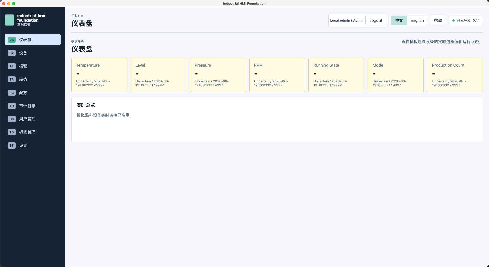

Dashboard 用来查看模拟混料设备的温度、液位、压力、转速、运行状态、模式和生产计数。未连接设备时，Tag Quality 会显示为 `Uncertain`，避免旧值被当成健康实时数据。

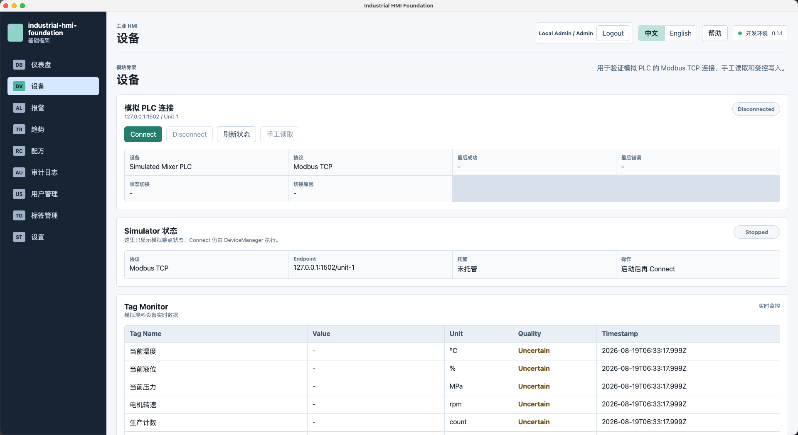

Device 页面保留设备连接状态、Simulator 状态摘要和 Tag Monitor。启动 Simulator 只是准备本地测试端点，真正连接设备仍然由 DeviceManager 执行。

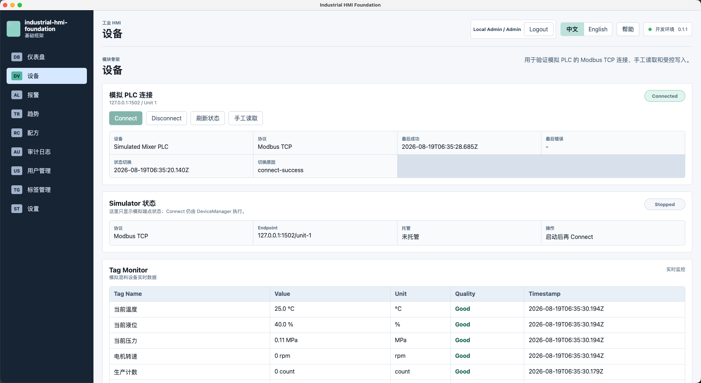

连接成功后，Tag Monitor 展示实时值、单位、Quality 和 timestamp。这里强调的是工业数据模型，而不是简单的 `tagId + value`。

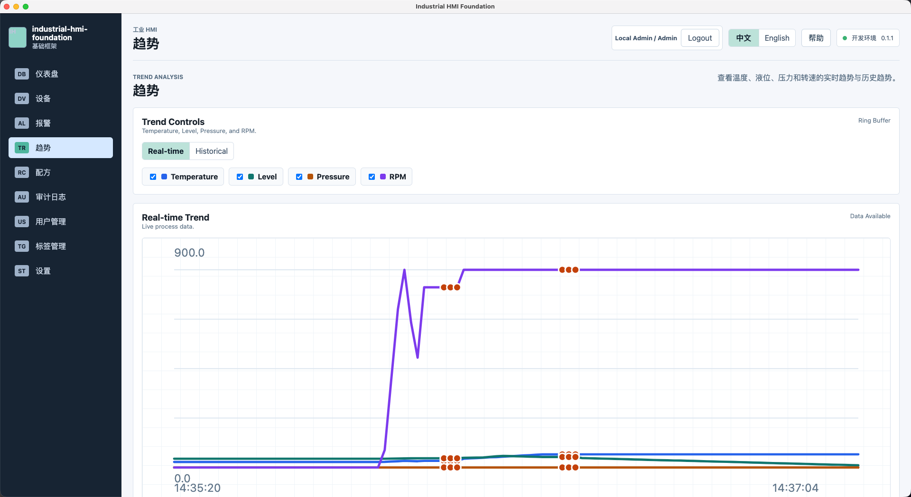

Trend 页面展示实时趋势和历史趋势。实时趋势使用有上限的 ring buffer，历史趋势来自 SQLite，避免长期运行时无限增长。

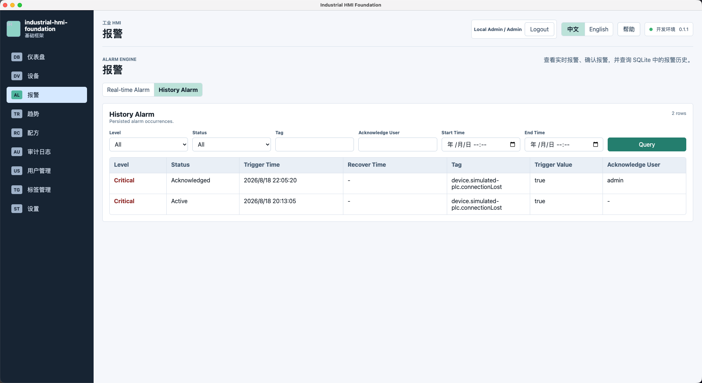

Alarm 页面区分实时报警和历史报警。报警确认不等于工况恢复，`Acknowledged` 和 `Recovered` 是两个不同状态。

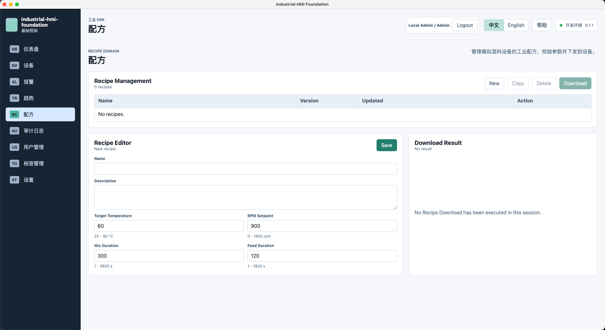

Recipe 页面不是普通表单。配方下载需要校验参数、生成命令、写入设备，并通过 read-back / verify 给出结果。

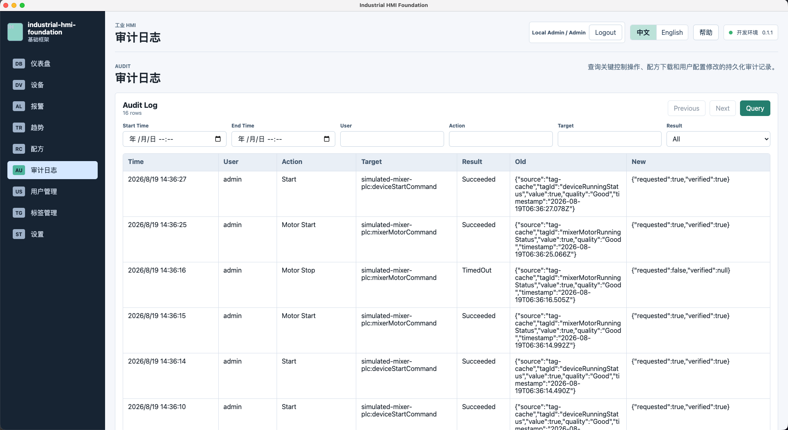

Audit Log 记录关键控制操作、配方下载和用户配置变更，便于演示工业控制软件中“谁在什么时候做了什么”。

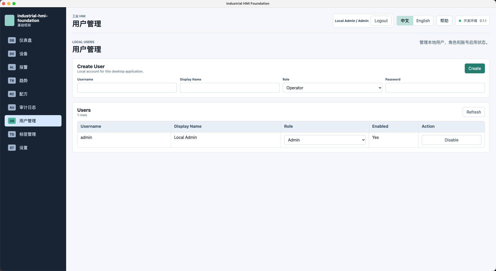

User Management 展示本地用户、角色和启用状态。Renderer 可以调整 UI，但关键写操作仍需要 Main Process 做权威权限校验。

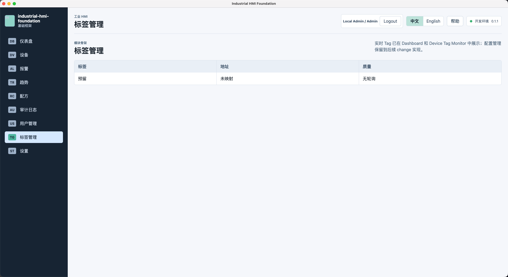

Tag Management 作为点位管理入口，后续可以扩展为完整配置界面。当前实时数据统一通过 Tag 模型进入 Dashboard、Device、Alarm、Trend 和 Historian。

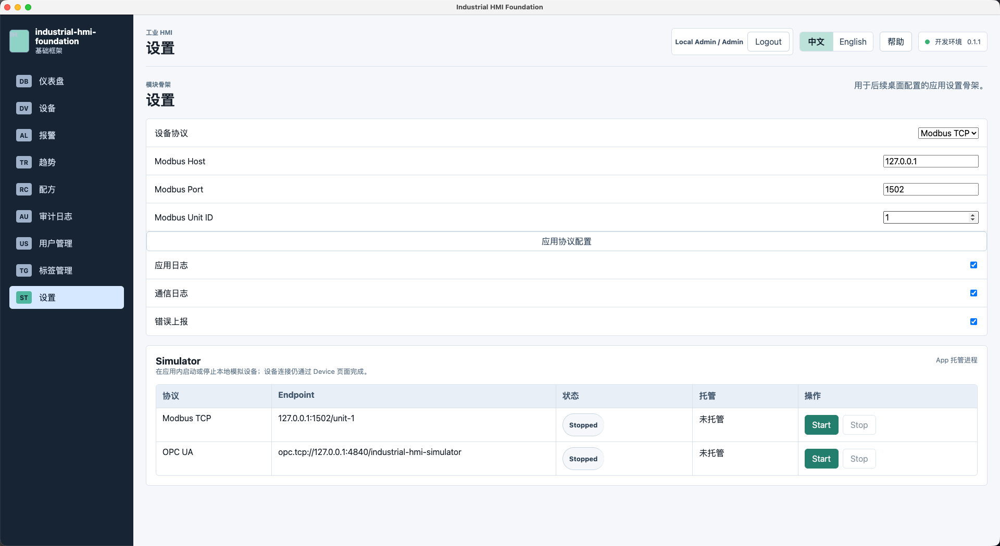

Settings 页面提供协议配置和应用内 Simulator 控制。普通演示路径是先启动 Simulator，再回到 Device 页面 Connect。

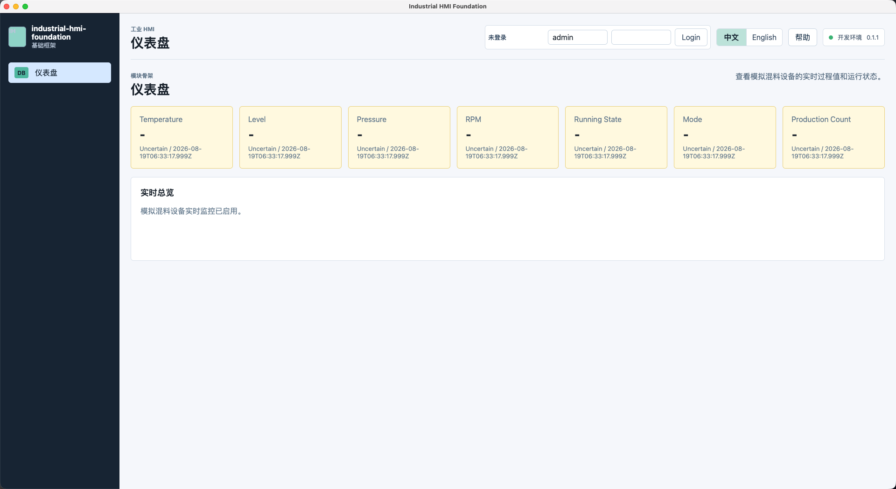

未登录状态下也可以看到 Dashboard 框架，但权限相关控制会按角色约束。

## 为什么用 Electron 做工业 HMI

工业 HMI 通常有几个典型诉求：

- 需要桌面应用形态，适合现场工控机或工程师电脑使用。
- 需要接入 TCP、协议库、本地数据库、日志和文件系统。
- UI 需要展示实时数据、趋势、报警、设备状态和控制入口。
- 业务层要和具体协议解耦，未来可能从 Simulator 切到真实 PLC 或网关。

Electron 的优势是可以把桌面能力放在 Main Process，把 UI 留在 Renderer。这个项目没有让 React 页面直接连接 PLC，也没有在 Renderer 中访问 TCP、Modbus、OPC UA 或 SQLite。

整体边界是：

```text
PLC / PLC Simulator
        |
        | Modbus TCP / OPC UA
        v
Electron Main Process
        |
        | DeviceManager / ProtocolAdapter / TagService
        | PollingScheduler / TagCache / CommandService
        | AlarmEngine / HistorianService / Recipe / Permission / Audit
        v
Preload typed window.hmi API
        v
Renderer ViewModel
        v
React View
```

这条链路的重点不是多画几层架构图，而是把职责压清楚：

- Main Process 负责工业通信、SQLite、系统日志、更新检查和资源生命周期。
- Preload 只暴露最小 typed API，不暴露 raw `ipcRenderer` 或 Node.js 模块。
- Renderer 只做 React View 和 ViewModel，不理解寄存器、NodeId、socket、SQL 或重连细节。

## MVVM：让页面少知道一点

这个项目的 Renderer 使用 React + MobX + MVVM。页面尽量是 View，业务状态和行为进入 ViewModel。

例如 Dashboard 不直接读 Modbus 寄存器，而是消费 ViewModel 整理后的设备状态和 TagValue。Device 页面也不直接写寄存器，而是通过 typed IPC 请求 Main Process 的 CommandService。

这样做的直接收益是：UI 可以随着产品变化调整，但通信、状态机、报警、历史数据和审计不用跟着页面乱动。

## 工业通信：Modbus TCP 和 OPC UA 不强行抹平

项目当前提供两个本地模拟协议入口：

| 本项目能力 | 模拟对象 | 对应真实协议/设备 | 当前边界 |
| --- | --- | --- | --- |
| Modbus TCP Simulator | 本地 TCP 模拟 PLC | Modbus TCP PLC、远程 IO、工业网关 | 已实现，默认协议，使用 polling 和连续地址批量读取 |
| OPC UA Simulator | 本地 OPC UA Server | OPC UA Server、PLC、SCADA、工业网关 | 已实现，可选协议，默认 subscription |
| Modbus RTU | 当前未实现 runtime | RS-485 / RS-232 串口 Modbus RTU 设备 | 只解释真实协议概念和未来 adapter 方向 |

Modbus TCP 更像寄存器读写模型，适合 polling。项目里的 PollingScheduler 会按 device、scanRate、registerType 和连续地址分组，尽量批量读取。

OPC UA 更像工业数据建模和订阅模型，适合 subscription / monitored item notification。项目没有把 OPC UA 硬拗成 Modbus polling，而是通过 adapter capability 让上层知道协议能力差异。

默认 OPC UA Simulator endpoint 是：

```text
opc.tcp://127.0.0.1:4840/industrial-hmi-simulator
```

本地 OPC UA Simulator 默认 anonymous / no-security，仅用于学习和本地测试，不代表生产 OPC UA 安全配置。

## Tag：工业实时数据不能只有 value

很多 demo 会把实时数据简化成：

```ts
{
  tagId: 'temperature',
  value: 25
}
```

这在工业场景里不够。设备断线、采集超时、协议异常、数据过期时，UI 不能继续把旧值当成正常实时数据。

本项目统一使用 Tag 模型：

```text
TagDefinition:
id / name / deviceId / address / registerType / dataType
scale / offset / unit / writable / scanRate

TagValue:
tagId / value / quality / timestamp
```

其中 `quality` 至少包含：

- `Good`
- `Bad`
- `Uncertain`

断线或采集失败时，可以保留 last value，但必须更新 quality 和 timestamp。Dashboard 和 Device Tag Monitor 看到的是这个统一模型，不需要知道底层来自 Modbus 还是 OPC UA。

## 采集：不要一个 Tag 一个 timer

工业点位一多，最容易写坏的是采集。

一个 Tag 一个 `setInterval` 看起来简单，但很快会带来定时器数量膨胀、请求重入、IPC 高频发送、React 高频 render 和资源清理困难。

这个项目把采集收敛到统一调度：

```text
PollingScheduler
  -> 按 device 分组
  -> 按 scanRate 分组
  -> 按 registerType 分组
  -> 按 address continuity 合并
  -> batch read
  -> TagService decode
  -> TagCache update
  -> IPC batch/throttle
  -> ViewModel
```

项目也提供 100、500、1000 Tag profile 的性能脚本入口，但 README 和文章不会写固定性能结论。真实性能以本机脚本生成的 `reports/performance/` 报告为准。

## Device State：用状态机表达连接生命周期

设备连接不是一个 `isConnected` 就能说清楚。

项目至少区分：

- `Disconnected`
- `Connecting`
- `Connected`
- `Reconnecting`
- `Fault`

通信失败后进入 `Reconnecting`，使用受控 backoff；手动断开进入 `Disconnected`；不可恢复错误进入 `Fault`。重新连接成功后恢复 polling 或 subscription，相关 Tag 重新获得 `Good` quality。

这类状态机在 HMI 项目里很关键，因为 UI、报警、命令和趋势都要知道当前数据还能不能被信任。

## 控制命令：写入成功不等于设备达到目标

控制 PLC 也不能从按钮直接写寄存器。

项目里的命令链路是：

```text
View
  -> ViewModel
  -> typed IPC
  -> Permission
  -> CommandService
  -> ProtocolAdapter
  -> Read-back / Verify
  -> Audit
```

CommandService 会处理 writable、类型、范围、设备状态、用户权限、busy/pending、timeout 和 read-back / verify。

这里有一个工业软件里很常见的区分：

- 通信写入成功：协议层返回写入响应。
- 设备状态达到目标：PLC 反馈值或 read-back 证明状态已经改变。

例如写入目标温度成功，不代表当前温度已经达到目标温度。电机启动命令写入成功，也不等于运行反馈已经为 true。

## 报警：Acknowledge 不等于 Recovered

报警不是 UI toast，而是一个独立 domain。

项目里的报警生命周期是：

```text
Inactive -> Active -> Acknowledged -> Recovered
```

`Acknowledged` 表示操作员已经确认看到了报警，`Recovered` 表示触发条件已经消失。高温仍然存在时，即使已经确认，也不能把报警当成恢复。

报警规则可以包含 threshold、level、delay、debounce、timestamp 和 triggerValue。历史报警写入 SQLite，重启后仍可查询。

## 趋势和 Historian：实时与历史分开

趋势页面分两类数据：

- 实时趋势：来自内存中的 bounded ring buffer。
- 历史趋势：来自 SQLite Historian。

Historian 写入策略支持 first sample、fixed interval、deadband 和 quality change，避免每次 polling 都无脑写数据库。

这也是 HMI 项目里很实际的取舍：实时曲线要流畅，但不能无限吃内存；历史查询要可追溯，但不能把数据库写爆。

## 配方：不是保存表单，是下载和验证

Recipe 在工业项目里是一组生产参数和控制目标。它不是一个普通 CRUD 表单。

本项目中的配方下载流程是：

```text
Recipe
  -> Validate
  -> Generate Commands
  -> CommandService
  -> Write
  -> Read-back / Verify
  -> Result
```

如果部分参数写入失败，Recipe Download 不能返回整体成功。下载结果需要给出明细，并记录到 Audit Log。

## 权限和审计：按钮隐藏不是权限

Renderer 可以按角色隐藏或禁用按钮，但这只能改善体验，不能作为唯一安全措施。

关键写操作仍然要由 Main Process / CommandService 做权限校验。项目里的角色包括 Operator、Engineer 和 Admin，不同角色可以承担日常操作、工程配置和用户管理等不同职责。

Audit Log 记录关键操作：

- Start / Stop
- Setpoint Change
- Valve Control
- Recipe Download
- Alarm Acknowledge
- Configuration Change

记录字段包括 timestamp、user、action、target、oldValue、newValue 和 result。

## 本地运行

安装依赖：

```bash
yarn install
```

启动开发环境：

```bash
yarn dev
```

普通演示路径：

1. 打开应用。
2. 进入 Settings 页面，在 `Simulator` 区域启动 Modbus TCP 或 OPC UA Simulator。
3. 回到 Device 页面执行 Connect。
4. 在 Dashboard、Device、Trend、Alarm、Recipe 和 Audit 页面观察状态变化。

维护者、自动化测试或独立协议验证也可以从命令行启动 Simulator：

```bash
yarn simulator:start
yarn simulator:opcua:start
```

需要注意：启动 Simulator 不等于连接设备。Simulator 只是本地测试端点，设备连接仍然走应用内 DeviceManager 流程。

## 建议 Demo 顺序

可以按下面顺序演示：

1. Settings：启动 Modbus TCP Simulator 或 OPC UA Simulator。
2. Device：Connect，观察连接状态从 Disconnected 到 Connected。
3. Dashboard：查看温度、液位、压力、RPM、运行状态、模式和生产计数。
4. Device Tag Monitor：查看 Tag Value、Unit、Quality 和 Timestamp。
5. Trend：查看实时趋势，再查询历史趋势。
6. Alarm：触发或查看报警，执行 acknowledge，解释 Acknowledged 和 Recovered 的区别。
7. Recipe：创建或选择配方，执行 Download，查看校验和结果。
8. Audit：查询 Start、Stop、Recipe Download、Alarm Acknowledge 等关键操作记录。
9. User Management：展示本地用户、角色和启用状态。
10. Tag Management：展示 Tag 管理入口和后续配置边界。

## 项目边界

这个项目刻意保持 Simulator-first。

它适合用来学习和展示：

- Electron 桌面应用工程。
- React + MobX + MVVM。
- Main / Preload / Renderer 安全边界。
- Modbus TCP polling 和 OPC UA subscription。
- Tag、Quality、设备状态、控制命令、报警、趋势、配方、权限和审计。

它不声称提供：

- 真实生产现场 Safety System。
- Safety PLC、安全继电器、硬件联锁或急停能力。
- SIL/PL、生产认证或现场网络安全合规。
- 生产 OPC UA 证书、安全策略或用户认证配置。
- Modbus RTU runtime。
- 未经脚本报告验证的固定性能指标。

如果要接入真实设备，还需要补齐现场网络、安全、协议、权限、验收、异常工况和长期运行验证。

## 继续阅读

- README：[../../README.md](../../README.md)
- 项目说明书：[../project-manual.md](../project-manual.md)
- Modbus Simulator：[../modbus-plc-simulator.md](../modbus-plc-simulator.md)
- OPC UA 依赖评审：[../opcua-dependency-review.md](../opcua-dependency-review.md)

这篇文章可以作为掘金发布草稿。发布时如果平台需要上传图片，可以把 `docs/assets/juejin/` 中的图片上传到掘金图床，再替换 Markdown 中的相对图片路径。
